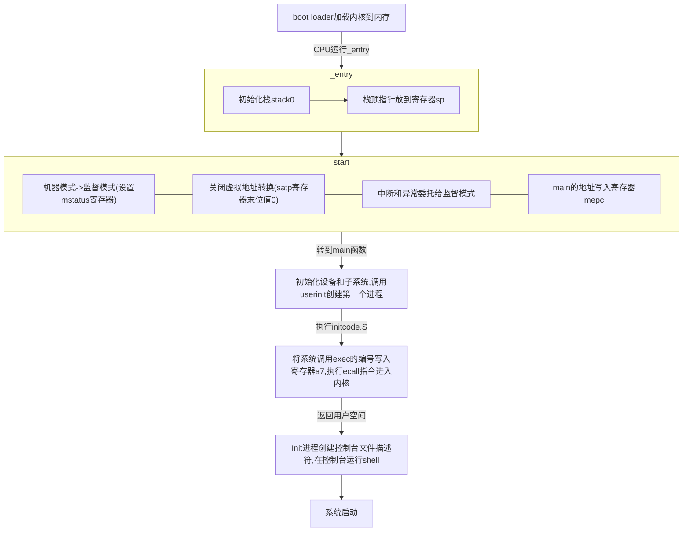

# util
## sleep
>Implement the UNIX program `sleep` for xv6; your `sleep` should pause for a user-specified number of ticks. A tick is a notion of time defined by the xv6 kernel, namely the time between two interrupts from the timer chip. Your solution should be in the file `user/sleep.c`.
**一些提示**
>- 阅读xv6参考书籍第一章
>- 查看`user/`下的文件如`echo.c`,`grep.c`,`rm.c`,了解如何将获得的命令行参数传递给程序
>- 在用户未输入参数时，给出错误提示
>- 命令行参数以字符串的形式传递，通过函数`atoi`(`user/ulib.c`)转为整数
>- 使用系统调用`sleep`
>- 查看内核代码`kernel/sysproc.c`了解系统调用`sleep`的实现(`sys_sleep`函数)，查看`user/user.h`了解可从用户程序调用的`sleep`定义，查看`user/usys.S`了解从用户代码跳转到内核代码的汇编程序
>- 在`main`函数中调用`exit()`来终止你的程序
>- 添加`sleep`程序到Makefile文件的`UPROGS`中，输入`make qemu`运行

**相关知识**

**int main(int argc,char*argv[ ])中的两个参数**

`argc`是命令行中输入的总的参数个数

`argv[]`是字符串形式的各个参数，默认第0个参数是程序的全名，以后的参数为命令行用户输入的参数

例如：
```c
    /* test.c */
    #include<stdio.h>
    int main(int argc, char* argv[])
    {
        for(int i = 0;i < argc;i++)
          printf("%s  ",argv[i]);
        return 0;
    }
```
在命令行运行输出：


据此可以将命令行参数传递给程序

**将命令行输入的字符串形式的参数转为整数**

`user/ulib.c`文件中包含`atoi`函数
```c
    int atoi(const char *s)
    {
        int n;
        n = 0;
        while('0' <= *s && *s <= '9')
            n = n*10 + *s++ - '0';
        return n;
    }
```
**系统调用`sleep`**

`user.h`中有`sleep`函数，在`usys.S`中有调用`sleep`的汇编代码
```S
    .global sleep
    sleep:
     li a7, SYS_sleep
     ecall
     ret
```
据此`sleep.c`如下：
```c
    #include "kernel/types.h"
    #include "kernel/stat.h"
    #include "user/user.h"

    int main(int argc,char *argv[])
    {
        if(argc < 2){
        fprintf(2,"sleep:time outs");
        exit(1);
        }

        int time = atoi(argv[1]);
        sleep(time);
        exit(0);
    }
```
## pingpong

> Write a program that uses UNIX system calls to ''ping-pong'' a byte between two processes over a pair of pipes, one for each direction. The parent should send a byte to the child; the child should print "\<pid>: received ping", where \<pid> is its process ID, write the byte on the pipe to the parent, and exit; the parent should read the byte from the child, print "\<pid>: received pong", and exit. Your solution should be in the file `user/pingpong.c`.

**一些提示**

>- 使用系统调用`pipe`创建管道
>- 使用系统调用`fork`创建子进程
>- 使用`read`向管道写入数据，使用`write`从管道中读取数据
>- 使用`getid`获取调用进程的PID
>- 在Makefile的`UPROGS`中添加程序
>- 在xv6上用户程序可以使用一些已有的库函数，在`user/user.h`中查看函数声明，除系统调用以外的函数源码可在`user/ulib.c`,`user/ulib.c`,`user/umalloc.c`中查看

**相关知识**

**文件描述符**

文件描述符表示了一个可以被内核读写的对象，进程涉及到的I/O对象都组织在进程的一张表中，文件描述符就是这张表的下标，在xv6中，0代表标准输入，1为标准输出，2为标准错误输出，`write(fd,buf,n)`/`read(fd,buf,n)`从指定的文件描述符中读写n个字节

**管道**

管道是一段内存缓冲区，向外暴露读/写文件描述符，管道提供了进程间交互的一种方式，在xv6中利用系统调用`pipe`可以设置一段管道

据此pingpong.c设置如下：
```c
    #include "kernel/types.h"
    #include "kernel/stat.h"
    #include "user/user.h"

    int main(int argc, char *argv[])
    {
        int pfc[2]; // pipe for father to child
        int pcf[2]; // pipe for child to father
        char byte = 'M';
        char buf[2];
        if (pipe(pfc) < 0)
        {
            fprintf(2, "pingpong:create pipe pfc failed\n");
            exit(1);
        }
        if (pipe(pcf) < 0)
        {
            fprintf(2, "pingpong:create pipe pcf failed\n");
            exit(1);
        }

        if (fork() == 0)
        {
            write(pcf[1], &byte, 1);
            read(pfc[0], buf, 1);
            if (buf[0] == byte)
                printf("%d:received ping\n", getpid());
            else
                printf("receive from father error\n");
        }
        else
        {
            write(pfc[1], &byte, 1);
            read(pcf[0], buf, 1);
            if (buf[0] == byte)
                printf("%d:received pong\n", getpid());
            else
                printf("receive from child error\n");
        }

        close(pfc[0]);
        close(pfc[1]);
        close(pcf[0]);
        close(pcf[1]);
        wait(0);
        exit(0);
    }
```
## primes

> Write a concurrent version of prime sieve using pipes. This idea is due to Doug McIlroy, inventor of Unix pipes. The picture halfway down this page and the surrounding text explain how to do it. Your solution should be in the file `user/primes.c`.

使用管道设置一个筛选素数的并发版本，使用系统调用`pipe`/`fork`设置线性管道，第一个进程向管道输入2-35，对于每一个素数，创建一个进程从左边管道读取并向右边管道写入

**一些提示**

>- 注意及时关闭程序不再用到的文件描述符，否则程序可能在到达35之前用尽xv6所提供的资源
>- 当地一个进程到达35后，应该等待直到整个线性管道终止，因此主进程应该在所有的输出已经呈现，所有其它进程终止以后退出
>- `read`在管道写入端关闭时返回0
>- 直接在管道中写入4字节的`int`是非常简单的，不要使用格式化的ASCII
>- 仅在管道中创建需要的进程
>- 把程序添加到Makefile的`UPROGS`中

用筛选法求素数的基本思想是在2-N的整数中，从2开始，筛选掉2的倍数，再筛选掉3的倍数 ··· 直至$\sqrt N$，则剩下的数为素数，从进程和管道出发大体如下：


每个进程各自有不同的用户地址空间,任何一个进程的全局变量在另一个进程中都看不到，所以进程之间要交换数据必须通过内核,在内核中开辟一块缓冲区,进程A把数据从用户空间拷到内核缓冲区,进程B再从内核缓冲区把数据读走,内核提供的这种机制称为进程间通信。

管道是进程间通信的一种方式，其内部提供同步的机制，可保证数据访问的一致性，当一个进程正在对管道执行读/写操作时，其它进程必须等待，一个进程将一定量的数据写入，然后就去睡眠等待，直到读进程将数据取走，再去唤醒，读进程与之类似。可以通过系统调用`pipe()`创建管道
```c
    int fd[2];
    pipe(fd);
```
创建成功`pipe()`返回0，失败返回1，`fd`返回两个文件描述符，`fd[0]`指向管道的读端，即从管道中读取数据的端口，`fd[1]`是管道的写入端，即向管道写入数据的端口，`fd[1]`的输入是`fd[0]`的输出。

父进程创建管道，得到指向管道两端的文件描述符，父进程创建子进程，子进程得到同样的两个文件描述符，由于管道只支持单向通信，当父进程关闭`fd[0]`，向`fd[1]`写入数据(`write(fd[1],,)`)，子进程关闭`fd[1]`,从`fd[0]`读出数据(`read(fd[0],,)`)，子进程便可接收到来自父进程的信息。

读写管道的特点

    ① 读管道：	1. 管道中有数据，read返回实际读到的字节数。
                2. 管道中无数据：
                    (1) 管道写端被全部关闭，read返回0 (好像读到文件结尾)。这个也是我们判断对方断开连接的方式。
                    (2) 写端没有全部被关闭，read阻塞等待(不久的将来可能有数据递达，此时会让出cpu)
    ② 写管道：	1. 管道读端全部被关闭， 进程异常终止(也可使用捕捉SIGPIPE信号，使进程不终止)
                2. 管道读端没有全部关闭： 
                    (1) 管道已满，write阻塞。
                    (2) 管道未满，write将数据写入，并返回实际写入的字节数。

资料参考自[https://blog.csdn.net/weixin_44517656/article/details/112412375]

```c
#include "kernel/types.h"
#include "kernel/stat.h"
#include "user/user.h"

void prime(int input_fd)
{
    int base;
    if (read(input_fd, &base, sizeof(int)) <= 0)
        exit(0);
    printf("prime %d\n", base);

    int p2[2]; // pipe from left to right
    if (pipe(p2) < 0)
    {
        fprintf(2, "primes:create pipe p2 failed\n");
        exit(1);
    }
    if (fork() == 0)
    {
        close(p2[1]);
        prime(p2[0]);
    }
    else
    {
        close(p2[0]);
        int number;
        while (read(input_fd, &number, sizeof(int)))
        {
            if (number % base != 0)
                write(p2[1], &number, sizeof(int));
        }
        close(p2[1]);
    }

    wait(0);
    exit(0);
}

int main(int argc, char *argv[])
{
    int p1[2];
    if (pipe(p1) < 0)
    {
        fprintf(2, "primes:create pipe p1 failed\n");
        exit(1);
    }

    int pid = fork();
    if (pid == 0) // child process
    {
        close(p1[1]);
        prime(p1[0]);
    }
    else if (pid > 0) // father process
    {
        close(p1[0]);
        for (int i = 2; i <= 35; i++)
            write(p1[1], &i, sizeof(int));
        close(p1[1]);
    }
    else
        fprintf(2, "primes:call fork error");

    wait(0);
    exit(0);
}
```
## find

> Write a simple version of the UNIX find program: find all the files in a directory tree with a specific name. Your solution should be in the file `user/find.c`.

**一些提示**

>- 查看`user/ls.c`了解如何读取目录
>- 使用递归让查找下降到子目录
>- 不要递归进入文件夹'.'和'..'
>- 通过qemu可以更改文件系统，运行`make clean`清理无关文件
>- 需要使用到C字符串，可以参阅C语言书籍K&R，例如5.5节
>- 比较字符串不能像python那样使用`==`，应该用`strcmp()`
>- 把程序添加到Makefile的`UPROGS`中

在xv6的文件系统中，结构体`stat`包含有关文件物理存储位置，大小，引用数等信息，在结构体`dirent`包含文件名及其长度，利用系统调用`open()`可以根据路径名获取指向文件的文件描述符，`fstat()`可以根据文件描述符获取`stat`结构体，利用`read()`系统调用可以根据文件描述符获取`dirent`结构体。
```c
    /* stat.h */
    #define T_DIR     1   // Directory
    #define T_FILE    2   // File
    #define T_DEVICE  3   // Device

    struct stat {
    int dev;     // File system's disk device
    uint ino;    // Inode number
    short type;  // Type of file
    short nlink; // Number of links to file
    uint64 size; // Size of file in bytes
    };

    /* dirent.h */
    // Directory is a file containing a sequence of dirent structures.
    #define DIRSIZ 14

    struct dirent {
    ushort inum;
    char name[DIRSIZ];
    };

    int fd;
    struct stat st;
    struct dirent de;
    fd = open (path,0);
    fstat(fd,&st);
    read(fd,&de,sizeof(de));
```
采用类似于`ls`的实现方式，设置了递归函数`int find(char *path,const chat filename)`，函数返回在path路径下查找到的文件数量，根据`stat`的`type`属性，对文件和目录分别处理，文件直接比对是否为查找目标，目录则生成再一层的路径，打开进入，递归`find()`函数，同样设置了`fmtname`函数，根据路径名获取末尾的文件名。具体实现见[`find.c`](./find.c)

## xargs

> Write a simple version of the UNIX xargs program: read lines from the standard input and run a command for each line, supplying the line as arguments to the command. Your solution should be in the file `user/xargs.c`.

**一些提示**

>- 使用`fork`和`exec`执行输入的每行的命令，使用`wait`在父进程中等待子进程完成命令
>- 逐行读入输入的命令，逐个读取字符直到换行符'\n'
>- `kernal/param.h`中声明了最多允许的参数个数

`xargs`是从stdin获取内容并将其作为后续命令地参数执行，弥补了管道无法将前面的标准输出作为后面地命令参数的缺陷，示例如下：

    zhao@WEN:~$ echo hello > txt
    zhao@WEN:~$ echo txt | cat
    txt
    zhao@WEN:~$ echo txt | xargs cat
    hello
    zhao@WEN:~$ 

在其具体实现中，采用两层循环，内层循环分割从管道读取的数据，通过遍历`buf`遇到`'\n'`则`fork()`子进程，传入规范好的参数调用`exec()`执行，外层循环则不断从管道中读取数据。详见[`xargs.c`](./xargs.c)
```c
#include "kernel/types.h"
#include "user/user.h"

int main(int argc, char *argv[])
{
    char input[32]; // record the input from previous command
    char buf[320];  // buf for the char of all token
    char *bufP = buf;
    int charBufSize = 0;

    char *commandToken[32]; // record the token from input spilt by space(' ')
    int tokenSize = argc - 1;
    int inputSize = -1;

    if (argc < 2)
    {
        fprint(2, "xargs: arguements error\n");
        exit(1);
    }
    // first copy initial argv argument to commandToken and skip "xargs"
    for (int tokenIdx = 0; tokenIdx < tokenSize; tokenIdx++)
        commandToken[tokenIdx] = argv[tokenIdx + 1];

    while ((inputSize = read(0, input, sizeof(input))) > 0)
    {
        for (int i = 0; i < inputSize; i++)
        {
            char curChar = input[i];
            if (curChar == '\n')
            {                         // if read '\n', execute the command
                buf[charBufSize] = 0; // set '\0' to end of token
                commandToken[tokenSize++] = bufP;
                commandToken[tokenSize] = 0; // set nullptr in the end of array

                if (fork() == 0)
                {
                    exec(argv[1], commandToken);
                }
                wait(0);
                tokenSize = argc - 1;
                charBufSize = 0;
                bufP = buf;
            }
            else if (curChar == ' ')
            {
                buf[charBufSize++] = 0; // mark the end of string
                commandToken[tokenSize++] = bufP;
                bufP = buf + charBufSize; // change to the start of new string
            }
            else
            {
                buf[charBufSize++] = curChar;
            }
        }
    }
    exit(0);
}
```

## 总结

实验用时较长，也参阅了网上大量资料，深感自身能力之不足，但庆幸于其中了解颇多计算机底层的相关概念，收获良多。


# System Call

## 预备知识

将硬件资源抽象为服务，将各个进程隔离；RISC-V的CPU可运行在`machine`模式，`supervisor`模式，`user`模式，`ecall`指令可以切换模式

内核的组织存在两种，为`monolithic kernel`和`microkernel`,前者设计更为方便，操作系统内核的各部分协作更方便，但对于使用者来说更易于出错，后者最小化执行在`supervisor`模式的代码，将大体量的操作系统执行在用户模式，xv6采用monolithic kernel.

进程抽象使程序拥有独立的地址空间，并给程序提供拥有整个硬件资源的假象，xv6使用页表给进程提供独占的地址空间，RISC-V的页表将虚拟地址`virtual address`转换为物理地址`physical address`

对于64位的RISC-V指令集，xv6使用38位作为寻址范围，最大地址为0x3fffffffff,在xv6的地址空间的顶端有在用户空间和内核空间之间跳转的页表*trampoline*和*trapframe*,前者包含进出内核的代码

xv6内核将进程的有关信息保存在结构体`struct proc`中，每个进程包含一个执行线程，线程的信息存储在栈中，每个进程包含两个栈，用户栈和内核栈，进程执行ecall指令，提升硬件特权级，进入内核态执行系统调用，`sret`指令降低硬件特权级并返回到用户指令继续执行。

RISC-V计算机启动后会首先加载*boot loader*,引导装载程序初始化硬件，将内核装入内存，首先在`machine`模式下，CPU从[`_entry`](https://github.com/mit-pdos/xv6-riscv/blob/759bb34113d214819b2f01b2c38c0b36a5ca775b/kernel/entry.S#L7)开始运行xv6,

```asm
    .section .text
    .global _entry
    _entry:
        # set up a stack for C.
        # stack0 is declared in start.c,
        # with a 4096-byte stack per CPU.
        # sp = stack0 + (hartid * 4096)
        la sp, stack0
        li a0, 1024*4
        csrr a1, mhartid
        addi a1, a1, 1
        mul a0, a0, a1
        add sp, sp, a0
        # jump to start() in start.c
        call start    
```

la指令常用来加载一个变量或函数的地址(具体见[RISCV汇编](https://blog.csdn.net/qq_38915354/article/details/118460201)),CSR是RISCV的控制与状态寄存器(control and status registers)，这些寄存器能够控制和反映当前CPU的状态和执行机制，典型的如`mstatus`,包含很多与CPU执行机制有关的状态位，`csrr`指令读取一个CSR的值到通用寄存器(详情可见[RISCV特权指令入门](https://juejin.cn/post/6891962672892837901))

```S
    csrr t0, mstatus  # 读取mstaus值到t0
    csrw mstatus, t0  # 将t0的值写入mstatus
```

C语言中可以嵌入汇编代码(详情见[C语言的内嵌汇编](https://zhuanlan.zhihu.com/p/348372132))，其语法格式为

```c
    asm volatile( /* volatile : 可选，禁止编译器对汇编代码进行优化 */
    "汇编指令"   /* 汇编指令间使用'\n'分隔 */
    :"=限制符"(输出参数)
    :"限制符"(输入参数)
    :保留列表
    )
```

在GNU C中利用`__attribute__`机制设置函数属性，变量属性和类型属性(详情见[C语言__attribute__的使用](https://blog.csdn.net/qlexcel/article/details/92656797))

    __attribute__ ((aligned (16)))      // 分配空间时采用16字节对齐方式

mrep是machine模式的一个寄存器，全称为Machine Exception Program Counter，详情见[machine寄存器](https://blog.csdn.net/humphreyandkate/article/details/112941145)，satp(Supervisor Address Translation and Protection，监管者地址转换和保护)是`supervisor`模式下的一个寄存器，低32位保存了根页表的物理地址,详情见[知乎文章-页表简介](https://zhuanlan.zhihu.com/p/61430196)




有关汇编语言的文章详见[汇编语言入门教程](https://zhuanlan.zhihu.com/p/54890424)，[手把手教你玩转RVSTAR—汇编程序篇](https://www.riscv-mcu.com/column-topic-id-458.html)，[RISC-V汇编语言入门（四）—组成、规范](https://zhuanlan.zhihu.com/p/501710795)，RISCV汇编语言学习网站:[https://riscv-programming.org/]

RISCV架构提出了标准的SBI(Supervisor Binary Interface)规范，SBI是直接运行在machine模式下的程序，为上层OS提供统一的系统调用环境，SBI程序拥有最高权限，OpenSBI是RISCV官方对SBI的一种实现，S模式下执行`ecall`指令可回到M模式使用相关的功能。参考文章[riscv开发之S模式ecall调用](https://www.cnblogs.com/dream397/p/15686532.html)，[RISC-V OpenSBI 快速上手](https://tinylab.org/riscv-opensbi-quickstart/)

xv6系统调用大致流程，在用户空间根据`user.h`提供的声明调用相应的系统调用，`usys.pl`脚本生成的`usys.S`负责转入内核执行，具体调用的系统调用编号放入寄存器`a7`，寄存器`a0`到`a5`存放相应的参数，然后`syscall`函数根据寄存器的值调用相应的系统调用函数(转入相应的地址)，将系统调用的执行结果放入寄存器`a0`，内核与用户之间的数据传送通过函数`argraw`,`fetchstr`等完成。

## system call tracing

按照以上系统调用的流程，首先在用户空间添加函数声明，在`user/user.h`中添加声明

```c
    // user/user.h
    ...
    int uptime(void);
    int trace(int); // new system call
    ...
```

在`user/usys.pl`中添加内核入口

```pl
    # user/usys.pl
    ...
    entry("uptime");
    entry("trace"); # new line
    ...
```

在`kernel/syscall.h`中添加该系统调用的编号

```h
    // kernel/syscall.h
    ...
    #define SYS_close 21
    #define SYS_trace 22    // new line
```

在`kernel/syscall.c`中函数指针数组添加一项并扩展系统调用函数

```c
    // kernel/syscall.c
    ...
    extern uint64 sys_uptime(void);
    extern uint64 sys_trace(void);  // new line
    ...
    [SYS_close]     sys_close,
    [SYS_trace]     sys_trace,  // new line
    ...
```

更改进程结构体，添加`mask`变量，指示要跟踪的系统调用编号

```c
    // kernel/proc.h
    struct proc{
        ...
        int mask;   // new var
    }
```

在`kernel/sysproc.c`中添加`sys_trace()`函数，该函数设置当前进程的`mask`变量，即要跟踪的系统调用编号，数据来源于寄存器`a0`，这是系统调用的参数

```c
    // kernel/sysproc.c
    uint64
    sys_trace()
    {
    int mask;

    if(argint(0,&mask)<0)
        return -1;
    myproc()->mask = mask;
    return 0;
    }
```

为了同样追踪子进程的系统调用，在`fork`函数中，将父进程的`mask`值传递给子进程

```c
    // kernel/proc.c
    int fork(void){
        ...
        np -> mask = p -> mask;     // new line
    }
```

在`syscall`函数中添加语句，以便在屏幕输出跟踪信息,根据提示，设置`syscalls_name`数组保存各个系统调用的名称

```c
    // kernel/syscall.c
    static char* syscalls_name[] = {
    [SYS_fork]    "fork",
    [SYS_exit]    "exit",
    [SYS_wait]    "wait",
    [SYS_pipe]    "pipe",
    [SYS_read]    "read",
    [SYS_kill]    "kill",
    [SYS_exec]    "exec",
    [SYS_fstat]   "fstat",
    [SYS_chdir]   "chdir",
    [SYS_dup]     "dup",
    [SYS_getpid]  "getpid",
    [SYS_sbrk]    "sbrk",
    [SYS_sleep]   "sleep",
    [SYS_uptime]  "uptime",
    [SYS_open]    "open",
    [SYS_write]   "write",
    [SYS_mknod]   "mknod",
    [SYS_unlink]  "unlink",
    [SYS_link]    "link",
    [SYS_mkdir]   "mkdir",
    [SYS_close]   "close",
    [SYS_trace]   "trace"
    };

    void
    syscall(void)
    {
    int num;
    struct proc *p = myproc();

    num = p->trapframe->a7;
    if(num > 0 && num < NELEM(syscalls) && syscalls[num]) {
        p->trapframe->a0 = syscalls[num]();
        if((1 << num) & p->mask)
        printf("%d: syscall %s -> %d\n",p->pid,syscalls_name[num],p->trapframe->a0);    // new ,output info
    } else {
        printf("%d %s: unknown sys call %d\n",
                p->pid, p->name, num);
        p->trapframe->a0 = -1;
    }
    }

```

## system call sysinfo

> In this assignment you will add a system call, `sysinfo`, that collects information about the running system. The system call takes one argument: a pointer to a `struct sysinfo` (see `kernel/sysinfo.h`). The kernel should fill out the fields of this struct: the `freemem` field should be set to the number of bytes of free memory, and the `nproc` field should be set to the number of processes whose state is not `UNUSED`. We provide a test program `sysinfotest`; you pass this assignment if it prints "sysinfotest: OK".

按照同样的流程，在用户空间声明系统调用`sysinfo`和对应的结构体`struct sysinfo`

```c
    // user/user.h
    struct sysinfo;
    int sysinfo(struct sysinfo*);
```

在内核空间定义该系统调用编号并加入到系统调用列表

```c
    // kernel/syscall.h
    #define SYS_sysinfo 23

    // kernel/syscall.c
    extern uint64 sys_sysinfo(void);
    static uint64 (*syscalls[])(void) = {
        ...
        [SYS_sysinfo]   sys_sysinfo,
    };
```

在`user/usys.pl`中添加进入内核的脚本

```pl
    # user/usys.pl
    entry("sysinfo");
```

在`kernel/kalloc.c`中添加计算空闲内存空间的函数，在xv6的内核内存空间中，按页管理内存，每页大小为4096byte(4K)，用链表组织空闲页的首地址，在RISCV中内存大端存放，内核后的第一个地址为`end`,对于一个空闲页，内容全部设为1，并将其挂载到空闲页链表中，通过`kfree`函数可看出`kmen.freelist`即为最后一个空闲链表的地址，因此只需从此处遍历到`end`，即可判断出空闲页的个数。

```c
    // kernel/kalloc.c
    uint64
    free_mem(void)
    {
        struct run *r = kmen.freelist;
        uint64 num = 0;
        while(r)
        {
            num++;
            r = r->next;
        }
        return num*PGSIZE;
    }
```

在`kernel/proc.c`中添加计算进程个数的函数，结构体数组`proc`中保存了当前的所有进程，在结构体`proc`中存在一项`procstate`指示了进程的状态，为枚举类型。因此只需遍历`proc`数组便可计算当前进程个数。

```c
    // kernel/proc.h
    enum procstate { UNUSED, USED, SLEEPING, RUNNABLE, RUNNING, ZOMBIE };
    struct proc {
        ...
        enum procstate state;        // Process state
        ...
    };

    // kernel/proc.c
    struct proc proc[NPROC];

    // proc_num
    uint64
    proc_num()
    {
        struct proc *p;
        uint64 num = 0;
        for(p = proc; p < &proc[NPROC]; p++)
        {
            acquire(&p->lock);
            if(p->state!=UNUSED)
                num++;
            release(&p->lock);
        }
        return num;
    }
```

然后编写系统调用函数`sys_sysinfo`，在该函数中利用`copyout`函数将内核数据拷贝到用户空间

```c
    uint64
    sys_sysinfo(void)
    {
        uint64 addr;    // virsual address in user space
        struct sys_info info;
        struct proc *p = myproc();

        if(argaddr(0,&addr) < 0)
            return -1;
        
        info.freemem = free_mem();
        info.nproc = proc_num();

        if(copyout(p->pagetable,addr,(char*)&info,sizeof(info)) < 0)
            return -1;

        return 0;
    }
```

在`kernel/defs.h`中添加函数`free_mem`,`proc_num`的声明。


## 实验总结

实验测试结果如下：


对系统调用的具体流程有了更加深刻的认识，了解了基本的汇编语言知识，在翻阅资料的过程中了解一些实验外的知识点，如C语言函数指针，Makefile文件编写，C语言内嵌汇编等等。


# page table

## 预备知识

页表方便操作系统实现进程隔离，更为高效的管理内存，RISCV的指令操作虚拟地址，`machine`模式地址直接映射，操作的是物理地址。

xv6运行在Sv39 RISC-V上，只用到了64位虚拟地址的低39位，其中39位的高27位为页表项(PTE)索引，低12为偏移地址，每个页表项由高44位的PPN和低10位的flags组成，PPN和原虚拟地址中低12位的偏移组成56位的物理地址，$2^{12}=4096$bytes，故一页的大小为4KB。在RISCV中采用三级页表映射从虚拟地址查找到物理地址。为了避免从物理内存中加载PTE的成本，RISC-VCPU将页面表条目缓存在翻译备用缓冲区(TLB)中，指令`sfence.vma`可以刷新TLB。根页表的物理地址存放在寄存器`satp`，每个CPU核都有独立的`satp`寄存器。

xv6内核使用直接映射获取RAM和内存映射的设备寄存器。每个进程设立一个页表，内核页表附于进程之中，但基本不随进程切换刷新。

物理内存的可用空间为*end-PHYSTOP*物理内存的分配采用空闲页面的链表组织，每个空闲页用`struct run`描述，该数据直接存储在空闲页中。

`exec`加载程序到内存时，利用函数`namei`打开所指路径的程序文件，xv6的可执行程序采用`ELF`格式，这是二进制文件，在xv6中采用结构体`struct elfhdr`和`struct proghdr`来描述`ELF`文件，`exec`加载文件时，首先检查文件格式是否合法，利用文件头部的`magic`数据可检查是否符合格式要求，具体有关ELF文件的格式内容，可参考书籍[程序员的自我修养](https://baike.baidu.com/item/%E7%A8%8B%E5%BA%8F%E5%91%98%E7%9A%84%E8%87%AA%E6%88%91%E4%BF%AE%E5%85%BB/5973585?fr=aladdin)。`exec`利用`proc_pagetable`函数分配一块未被映射的页表，`loadseg`函数将ELF文件的每一段加载到分配的内存中，`readi`函数从文件中读取内容。

## speed up system calls

实验的主要目的在于通过在特定地址处共享数据来加速系统调用，本实验主要是针对系统调用`getpid()`，在`memlayout.c`文件中定义了存放该数据的虚拟地址`USYSCALL`及相应的数据结构。

```c
// kernel/memlayout.c
#ifdef LAB_PGTBL
#define USYSCALL (TRAPFRAME - PGSIZE)

struct usyscall {
  int pid;  // Process ID
};
#endif
```

主要思路是在`struct proc`中添加`usyscall`的结构体，在每次加载一个进程时，分配`usyscall`的物理内存并将其映射到`USYSCALL`的虚拟内存，在进程调度切换时，释放该内存，如此可以做到在要获取进程id时，直接访问该虚拟地址而不是陷入内核使用系统调用，从而提升速度。

首先向`struct proc`中添加`usyscall`，存放指针则可以使所有进程的usyscall指向同一块物理内存。

```c
// kernel/proc.h
struct proc {
  ...
  char name[16];               // Process name (debugging)
  struct usyscall *usyscall;    // quick access to pid
};
```
在`allocproc()`中为该结构申请一块物理内存，并正确设置指针`usyscall`的值

```c
static struct proc*
allocproc(void)
{
  struct proc *p;
  ...
  // allocate a usyscall page.
  if((p->usyscall = (struct usyscall *)kalloc()) ==0 ){
    freeproc(p);
    release(&p->lock);
    return 0;
  }
  p->usyscall->pid = p->pid;
  return p;
}
```
在`proc_pagetable`函数中建立申请到的物理内存到虚拟地址的映射,映射建立失败时回收已分配的内存，对于该内存区域来说，用户只需读取，因此相应标记为PTE_R ,PTE_U

```c
pagetable_t
proc_pagetable(struct proc *p)
{
  pagetable_t pagetable;
  ...
  // map the usyscall(quick access to pid) at USYSCALL
  if(mappages(pagetable, USYSCALL, PGSIZE, 
              (uint64)(p->usyscall),PTE_R | PTE_U) < 0){
    uvmunmap(pagetable,TRAPFRAME,1,0);
    uvmunmap(pagetable,TRAMPOLINE,1,0);
    uvmunmap(pagetable,0);
    return 0;
  }

  return pagetable;
}
```

在进程结束时，释放相应物理内存并解除虚拟地址的映射
```c
// kernel/proc.c
// free physical memory
static void
freeproc(struct proc *p)
{
  ...
  if(p->usyscall)
    kfree((void*)p->usyscall);
  p->usyscall = 0;
  ...
}

// kernel/proc.c
// free a process's page table
void
proc_freepagetable(pagetable_t pagetable, uint64 sz)
{
  ...
  uvmunmap(pagetable, USYSCALL, 1, 0);
  ...
}
```

通过本实验可以看出凡是需要陷入内核获取数据的系统调用均可以采用映射到固定内存地址的方式加快速度。

## print a page table

打印页表内容，其格式是按照三级页表的层次关系，逐层的打印出虚拟地址和对应的物理地址，设置函数`vmprint(pagetable)`于`kernel/vm.c`中。根据提示，参照函数`freewalk()`来遍历三层页表，采用递归的方法，首先遍历第一层，在当前层的每一项进行又一次递归进入下一层，按照既定的格式输出即可。

由于实验要求函数只传递一个参数`pagetable`，因此无法确定函数已递归到哪一层，因此另设函数`fu`，多传递层数参数，便于及时终止递归

```c
void
vmprint_levels(pagetable_t pagetable, int level){
  for(int i = 0; i < 512; i++){
    pte_t pte = pagetable[i];
    if(pte & PTE_V){
      uint64 child = PTE2PA(pte);
      if(level == 0){
        printf("..%d: pte %p pa %p\n",i,pte,child);
        vmprint_levels((pagetable_t)(child),level+1);
      }else if(level == 1){
        printf(".. ..%d: pte %p pa %p\n",i,pte,child);
        vmprint_levels((pagetable_t)(child),level+1);
      }else if(level == 2){
        printf(".. .. ..%d: pte %p pa %p\n",i,pte,child);
      }else{;}
    }
  }
}

void
vmprint(pagetable_t pagetable){
  printf("page table %p\n",pagetable);
  vmprint_levels(pagetable,0);
}
```

在`kernel/defs.h`中添加函数声明

```c
void vmprint_levels(pagetable_t,int);
void vmprint(pagetable_t);
```

在`exec()`添加对第一个进程的虚拟页表打印

```c
if(p->pid == 1){
  vmprint(p->pagetable);
}
```

## detecting which pages have been accessed

添加新的系统调用`pgaccess()`向用户空间报告哪些页面已被允许访问。该系统调用接受三个参数，第一个是第一个用户页面的起始地址，第二个是要检查的页数，第三个是位于用户空间的存储结果的地址。实验中已经对系统调用所需的用户代码，入口地址等代码进行了完善，只需在函数`sys_pgaccess()`中完成基本逻辑即可。传参方式类似于lab2，通过访问a0-a5的寄存器，利用函数`argaddr()`,`argint()`等从寄存器获取目标类型的参数。PTE_A是指示页表项是否已被访问的标志位，通过查看RISCV的手册得知，PTE_A位于第六位。

```c
// kernek/riscv.h
#define PTE_A (1L << 6)
```

利用`walk()`函数通过虚拟地址获取页表项PTE_A的值

```c
//kernel/vm.c
int
pgaccess(pagetable_t pg,uint64 va){
  pte_t * pte;
  if(va > MAXVA){
    return 0;
  }

  pte = walk(pg,va,0);
  if(pte == 0){
    return 0;
  }

  if(*pte & PTE_A){
    *pte &= (~PTE_A);
    return 1;
  }
  return 0;
}
```

获取相应参数，计算结果，并写入到用户空间的目标地址

```c
int
sys_pgaccess(void)
{
  // lab pgtbl: your code here.
  struct proc *p = myproc();
  if(p == 0){
    return -1;
  }

  uint64 va_s;      // va start
  int num;          // total page num
  int result_addr;  // result
  if(argaddr(0,&va_s)<0){
    return -1;
  }
  if(argint(1,&num)<0){
    return -1;
  }
  if(argint(2,&result_addr)<0){
    return -1;
  }
  if(num>32||num<=0){
    return -1;
  }
  int res = 0;
  for(int i = 0;i<num; i++){
    uint64 va = va_s + (uint64)PGSIZE*i;
    int bits = pgaccess(p->pagetable,(uint64)va);
    res |= (bits << i);
  }
  if(copyout(p->pagetable, result_addr,(char*)&res,sizeof(res))<0){
    return -1;
  }
  return 0;
}
```

## 实验总结

通过本次实验了解到虚拟内存具体的运作机制，虚拟地址到物理地址的映射关系，内存的分配等等，也了解到了RISCV的一些汇编指令。


# traps

## 预备知识

所谓*trap*可以理解为CPU从原本的顺序执行指令突然跳转到特定位置处执行的一种行为，在xv6中可分为三种情况，系统调用，异常，设备中断

每个RISCV的CPU都有一组控制寄存器描述CPU如何处理*trap* <br>
- `stvec`    :*trap*处理程序的地址
- `sepc`     :保存原本程序计数器PC的值
- `scayse`   :其值描述*trap*发生的原因
- `scratch`  :保存*trap*处理程序开始执行前的的一个重要数值
- `sstatus`  :其SIE位控制是否启用设备中断，SPP位指示*trap*来自用户模式还是监督模式

在处理来自用户空间的*trap*时，xv6在切换到处理*trap*的程序时不会切换页表，因此陷阱处理程序需要在用户页表中有一个有效的映射，xv6为每一个进程设置了*trampoline*页面，该页面将`stvec`所表示的地址映射到处理*trap*的代码的地址，该页面位于虚拟地址空间的末端，在开始执行之前，先将用户程序的32个寄存器的值保存到*trapframe*页面中，该结构映射到*trampoline*的下面紧邻的位置，寄存器`a0`将保存*trapframe*的地址。

当处理来自内核空间的*trap*时，如果内核代码出现了异常将导致系统崩溃，计时器中断将会强制切换当前的进程，xv6中暂不处理设备中断。

## RISC-V assembly

本实验主要是学习了解一些RISCV汇编指令，示例程序`call.c`如下

```c
// call.c
int g(int x) {
  return x+3;
}

int f(int x) {
  return g(x);
}

void main(void) {
  printf("%d %d\n", f(8)+1, 13);
  exit(0);
}
```
编译后的汇编代码主要内容如下
```asm
000000000000000e <f>:

int f(int x) {
   e:	1141                	addi	sp,sp,-16
  10:	e422                	sd	s0,8(sp)
  12:	0800                	addi	s0,sp,16
  return g(x);
}
  14:	250d                	addiw	a0,a0,3
  16:	6422                	ld	s0,8(sp)
  18:	0141                	addi	sp,sp,16
  1a:	8082                	ret

000000000000001c <main>:

void main(void) {
  1c:	1141                	addi	sp,sp,-16
  1e:	e406                	sd	ra,8(sp)
  20:	e022                	sd	s0,0(sp)
  22:	0800                	addi	s0,sp,16
  printf("%d %d\n", f(8)+1, 13);
  24:	4635                	li	a2,13
  26:	45b1                	li	a1,12
  28:	00000517          	    auipc	a0,0x0
  2c:	7a050513          	    addi	a0,a0,1952 # 7c8 <malloc+0xe8>
  30:	00000097          	    auipc	ra,0x0
  34:	5f8080e7          	    jalr	1528(ra) # 628 <printf>
  exit(0);
  38:	4501                	li	a0,0
  3a:	00000097          	    auipc	ra,0x0
  3e:	274080e7          	    jalr	628(ra) # 2ae <exit>
```

1. Which registers contain arguments to functions? For example, which register holds 13 in main's call to printf?

在RISCV指令集中，寄存器a0-a7保存函数的参数，寄存器a0,a1保存函数的返回值，在本题中，寄存器a2保存了值13
24:	4635                	li	a2,13

2. Where is the call to function f in the assembly code for main? Where is the call to g? (Hint: the compiler may inline functions.)

main函数没有调用g,f函数，没有跳转到这两个函数的汇编代码，g(x)被内联到f(x),f(x)又被内联到main()函数中，编译器在此做了优化。

3. At what address is the function printf located?

printf的入口地址在0x628
```asm
void
printf(const char *fmt, ...)
{
 628:	711d                	addi	sp,sp,-96
 ```

 4. What value is in the register ra just after the jalr to printf in main?

 ra寄存器的值为0x38, `jalr 1528(ra)`指令的含义为pc+4并跳转到1528+$ra的地址开始执行，1528+0x38=0x628

 5. Run the following code.
    ```c
	unsigned int i = 0x00646c72;
	printf("H%x Wo%s", 57616, &i);
    ```
    What is the output? Here's an ASCII table that maps bytes to characters.
    The output depends on that fact that the RISC-V is little-endian. If the RISC-V were instead big-endian what would you set i to in  order to yield the same output? Would you need to change 57616 to a different value?
    Here's a description of little- and big-endian and a more whimsical description.

程序输出：
```c
HE110 World
```
小端序是指低位字节放在低地址处，大端序是指低位字节放在高地址处，读取时从低地址处开始读取，r,l,d的ASCII分别是0x72,0x6c,0x64，因此若RISC-V是大端序时，i应该设置为0x726c6400，不论大端序小端序，57616的16进制值都是0xe110(不是ello)，因此不需要改变。

6. In the following code, what is going to be printed after 'y='? (note: the answer is not a specific value.) Why does this happen?
    ```c
	printf("x=%d y=%d", 3);
    ```

输出的是随机值，printf尝试读取的参数多于设置的参数，3存于寄存器a1中，寄存器a2是之前指令执行要用到的值，因此本次printf读取到的是随机值。

## Backtrace

在`kernel/printf.c`中实现函数`backtrace()`，时期能够打印出函数调用栈，即输出函数层级调用的地址。在函数调用栈的每一个栈帧中都保存了指向调用当前函数的上一函数的指针。

首先在`kernel/defs.h`中添加函数声明
```c
// kernel/defs.h
void backtrace(void);
```

当前执行函数的栈帧指针存放于寄存器s0中，向`kernel/riscv.h`中添加读取寄存器s0的内联函数

```c
static inline uint64
r_fp()
{
  uint64 x;
  asm volatile("mv %0, s0" : "=r" (x) );
  return x;
}
```

在[lecture note](https://pdos.csail.mit.edu/6.828/2021/lec/l-riscv-slides.pdf)第5页中介绍了栈帧的结构，当前栈顶指针偏移8个字节(-8)则指向当前函数的返回地址，偏移16个字节(-16)则是指向上一函数栈帧的栈顶指针。xv6为整个个栈帧分配了一个页面即4K，通过`PGROUNDDOWN(fp)`和`PGROUNDUP(fp)`函数可以确定当前栈的首地址和末尾地址，从而终止循环。

```c
void
backtrace(void){

  printf("backtrace:\n");

  uint64 fp = r_fp();
  uint64 *frame = (uint64 *)fp;
  uint64 up = PGROUNDUP(fp);
  uint64 down = PGROUNDDOWN(fp);

  while(fp < up && fp > down){
    printf("%p\n",frame[-1]);
    fp = frame[-2];
    frame = (uint64 *)fp;
  }
}
```

## Alarm

xv6在处理*trap*时，`ecall`指令修改执行模式从用户态到内核态，设置`scause`寄存器以反映*trap*的原因，保存原pc值，修改pc到处理程序并跳转到处理程序，接下来`uservec`函数开始执行，该函数保存当前用户态下的32个寄存器值，保存到结果体`struct trapframe`中，切换到内核的栈空间，页表，然后跳转到`usertrap()`函数继续执行，`usertrap()`根据*trap*的来源(系统调用/异常/中断/计时器中断等)通过判断跳转到相应的程序代码处理*trap*，然后跳转到`usertrapret()`函数继续执行，`usertrapret()`函数重新设置了`p->trapframe`中的值，以便下一次*trap*的正确执行，并恢复了寄存器`stvec`,`sepc`的值。然后跳转到`userret()`函数，该函数恢复用户空间寄存器的值，装入用户空间的页表，栈空间，执行`sret`指令回到用户态，并切换会原来的pc值

本实验采用计时器中断的方式来实现一个周期执行的函数，即系统调用`sigalarm(int, handler)`，在经过int个时钟周期后，执行handler

首先在Makefile中添加测试程序的编译选项

```makefile
UPROGS = \
    $U/_alarmtest\
```

在`user.h`中添加系统调用的声明

```c
int sigalarm(int ticks, void (*handler)());
int sigreturn(void);
```

更新`user/usys.pl`,`kernel/syscall.h`,`kernel/syscall.c`以支持系统调用`sigalarm`和`sigreturn`

```c
//user/usys.pl
entry("sigalarm");
entry("sigreturn");

//kernel/syscall.h
#define SYS_sigalarm 22
#define SYS_sigreturn 23

//kernel/syscall.c
extern uint64 sys_sigalarm(void);
extern uint64 sys_sigreturn(void);
...
[SYS_sigalarm] sys_sigalarm,
[SYS_sigreturn] sys_sigreturn,
```

向`proc`增添字段存储两个参数`int`和`handler`，再增添一个时钟计时的字段

```c
int ticks;
int ticks_count;
uint64 handler;
```

在`kernel/proc.c`的`allocproc()`函数中初始化上述新增字段

```c
p->ticks = 0;
```

每经过一个时钟周期，硬件时钟都会强制一个中断，该中断处理程序在`kernel/trap.c`的`usertrap()`函数中，在其中添加alarm的处理逻辑,trapframe中epc寄存器存储中断返回执行的地址，此处设置为`handler`则实现每隔`ticks`个时钟周期返回`handler`处执行一次

```c
f(which_dev == 2){
    
    if(p->ticks>0){
      p->ticks_count++;
      if(p->ticks_count > p->ticks){
        p->ticks_count = 0;
        p->trapframe->epc = p->handler;
      }
    }
    yield();
  }
```

至此test0基本完成，test1和test2主要是恢复寄存器的值以及避免重复执行，相关代码如下

在`kernel/proc.h`的`struct proc`中新增两个字段，`is_alarming`指示报警程序是否已执行，`*alarm_trapframe`用于恢复各个寄存器的值

```c
// struct proc
int is_alarming;
struct trapframe* alarm_trapframe;
```

在`allocproc()`中分配内存并初始化，在`freeproc()`中释放内存

```c
// kernel/proc.c
static struct proc*
allocproc(void)
{
  ...
if((p->alarm_trapfram = (struct trapframe*)kalloc())==0){
    freeproc(p);
    release(&p->lock);
    return 0;
  }
  p->is_alarming = 0;
  ...
}

static void
kfree(struct proc* p)
{
  if(p->alarm_trapfram)
    kfree((void*)p->alarm_trapfram);
  p->is_alarming = 0;
  p->handler = 0;
  p->ticks = 0;
  p->ticks_count = 0;
  ...
}
```

更改`usertrap`函数，将`p->trapframe`保存到`p->alarm_trapframe`中，并设置`is_alarming`

```c
if(which_dev == 2){

    if(p->ticks>0 && p->is_alarming == 0){
      p->ticks_count++;
      if(p->ticks_count >= p->ticks){
        memmove((void*)p->alarm_trapframe,(void*)(p->trapframe),sizeof(struct trapframe));
        p->ticks_count = 0;
        p->is_alarming = 1;
        p->trapframe->epc = p->handler;
      }
    }
    yield();
  }
```

设置`sys_sigreturn()`函数，恢复原来的寄存器值

```c
uint64
sys_sigreturn(void)
{
  struct proc *p = myproc();
  memmove((void*)p->trapframe,(void*)p->alarm_trapframe,sizeof(struct trapframe));
  p->is_alarming = 0;
  return 0;
}
```

## 实验总结

整个实验是有一定的难度的，我在完成实验的过程中，参阅了大量资料，结合讲义和网上文章，大致了解了xv6处理*trap*的一般流程，通过源码研读，代码调试，逐渐完成了本实验的所有内容。


# Copy-on-Write Fork for xv6

xv6的系统调用`fork()`将父进程的所有用户空间复制到子进程中，则当父进程较大时复制操作较为费时，并且这种处理方式可能会造成资源的浪费，例如子进程里执行`exec()`，则复制的内存大多不被使用，造成浪费，但当父子进程有一方对同时享有的页表进行写入时，内存复制就是很必要的了。

COW采取的措施是直到必要时才为子进程分配物理页面，COW只为子进程创建一个页表，且该页表指向父进程的物理页面，并对父子进程将页面标记为不可写入，当任一进程试图写入COW页面时，CPU强制产生页面错误，内核页面错误处理程序检测到这种情况为出错进程分配一块新的物理内存，并复制页面内容，修改错误进程的PTE使其指向新的页面，并标记为可写，然后用户进程就可在新的复制页面上写入。

这样可能导致同一个物理页面被多个进程的页表引用，只有当所有进程都不再引用时，该物理页才可释放。

首先修改`uvmcopy()`,将父进程的物理页映射到子进程，并清除PTE_W,此外还需要设置在PTE中标记COW位，用于说明该页面是否为COW页，在PTE中，第8/9位为保留位，这里使用第八位

```c
// kernel/ricsv.h
#define PTE_COW (1L << 8)

// kernel/vm.c
int
uvmcopy(pagetable_t old, pagetable_t new, uint64 sz)
{
  pte_t *pte;
  uint64 pa, i;
  uint flags;
  char *mem;

  for(i = 0; i < sz; i += PGSIZE){
    if((pte = walk(old, i, 0)) == 0)
      panic("uvmcopy: pte should exist");
    if((*pte & PTE_V) == 0)
      panic("uvmcopy: page not present");
    pa = PTE2PA(*pte);
    // set cow page and unwritable
    *pte = (*pte | PTE_COW) & (~PTE_W);
    flags = PTE_FLAGS(*pte);
    
    if(mappages(new, i, PGSIZE, pa, flags) != 0){
      goto err;
    }
  }
  return 0;

 err:
  uvmunmap(new, 0, i / PGSIZE, 1);
  return -1;
}
```

修改`usertrap()`函数用于处理COW页面错误，`is_cowpage()`函数用于判断是否为COW页面引发的异常，`cowalloc()`用于分配物理内存

```c
// kernel/trap.c
void
usertrap(void)
{
  int which_dev = 0;

  if((r_sstatus() & SSTATUS_SPP) != 0)
    panic("usertrap: not from user mode");
  w_stvec((uint64)kernelvec);

  struct proc *p = myproc();
  p->trapframe->epc = r_sepc();
  
  if(r_scause() == 8){
    if(p->killed)
      exit(-1);
    p->trapframe->epc += 4;
    intr_on();
    syscall();
  } else if((which_dev = devintr()) != 0){
    // ok
  } else if(r_scause() == 13 || r_scause == 15){
    // page fault
    // 发生断点，地址不对齐，访问错误，缺页异常时，stval被写入包含错误的虚拟地址
    uint64 fault_va = r_stval();
    if(is_cowpage(p->pagetable,fault_va)){
        // 是COW页面发生的缺页异常
        // 分配新的物理页面
      if(cowalloc(p->pagetable,fault_va) < 0){
        printf("usertrap() : cow_alloc page failed, scause=%d, pid=%d\n",r_scause(),p->pid);
        p->killed = 1;
      }
    }else{
        // 异常，非缺页异常，杀死进程
      printf("usertrap(): unexpected scause %p pid=%d\n", r_scause(), p->pid);
      printf("            sepc=%p stval=%p\n", r_sepc(), r_stval());
      p->killed = 1;
    }

  }else {
    printf("usertrap(): unexpected scause %p pid=%d\n", r_scause(), p->pid);
    printf("            sepc=%p stval=%p\n", r_sepc(), r_stval());
    p->killed = 1;
  }

  if(p->killed)
    exit(-1);
  if(which_dev == 2)
    yield();
  usertrapret();
}
```

`is_cowpage()`函数，判断是否为COW页面，主要利用PTE_COW标志位，函数逻辑类似于`walkaddr()`

```c
int
is_cowpage(pagetable_t pagetable, uint64 va)
{
  pte_t *pte;

  if(va >= MAXVA)
    return 0;

  pte = walk(pagetable, va, 0);
  if(pte == 0)
    return 0;
  if((*pte & PTE_V) == 0)
    return 0;
  if((*pte & PTE_U) == 0)
    return 0;
  if((*pte & PTE_COW) == 0)
    return 0;
  
  return 1;
}
```

在为COW页面分配物理内存之前，需要先解决引用计数的问题，解决思路是为每一个物理页面设置一个计数器，将其设置为总的被引用次数，当释放物理内存时，只有当引用计数为1时才释放所占内存，其余只将引用计数减一，内核空间始于end，终于PHYSTOP，因此总的页面个数可设置为(PHYSTOP-KERNBASE)/PGSIZE

```c
// kernel/kalloc.c

// 添加引用计数数组ref_count[]
struct {
  struct spinlock lock;
  struct run *freelist;
  int pages_count;          // 页面总数
  uint8 ref_count[(PHYSTOP-KERNBASE)/PGSIZE];
} kmem;

// 初始化计数数组
void
kinit()
{
  initlock(&kmem.lock, "kmem");
  freerange(end, (void*)PHYSTOP);
  for(int i = 0; i < ((PHYSTOP-KERNBASE)/PGSIZE); i++)
    kmem.ref_count[i] = 0;
  
  kmem.pages_count = 0;
  char *p;
  p = (char*)PGROUNDUP((uint64)end);
  for(; p + PGSIZE <= (char*)PHYSTOP; p+=PGSIZE)
    kmem.pages_count++;
}

// 获取在引用计数数组中索引
int
page_index(void *pa)
{
  pa = PGROUNDDOWN((uint64)pa);
  if(((uint64)pa % PGSIZE) != 0 || (char*)pa < end || (uint64)pa >= PHYSTOP)
    panic("page_index\n");
  return ((uint64)pa-(uint64)PGROUNDUP(end))/PGSIZE;
}

// 获取当前页面的引用计数
int
get_ref_count(uint64 pa)
{
  return kmem.ref_count[page_index(pa)];
}

// 相应物理页引用计数加1
void
add_ref(void*pa)
{
  acquire(&kmem.lock);
  kmem.ref_count[page_index(pa)]++;
  release(&kmem.lock);
}

// 相应物理页引用计数减1
void
minus_ref(void*pa)
{
  acquire(&kmem.lock);
  kmem.ref_count[page_index(pa)]--;
  release(&kmem.lock);
}
```

修改`kfree()`函数，使其只当引用计数为1时才释放空间，当引用计数为1时，直接清零

```c
void
kfree(void *pa)
{
  int index = page_index(pa);
  if(kmem.ref_count[index] > 1){
    kmem.ref_count[index]--;
    return ;
  }
  if(kmem.ref_count[index] == 1)
    minus_ref((uint64)pa);
  ...
}
```

在物理页面的第一次被分配以及后续COW页面映射时，执行`add_ref()`函数，增加应用计数

```c
// kernel/kalloc.c
void *
kalloc(void)
{
  struct run *r;

  acquire(&kmem.lock);
  r = kmem.freelist;
  if(r)
    kmem.freelist = r->next;
  release(&kmem.lock);

  if(r)
  {
    memset((char*)r, 5, PGSIZE); // fill with junk
    add_ref((uint64)r);
  }
  
  return (void*)r;
}

// kernel/vm.c
int
uvmcopy(pagetable_t old, pagetable_t new, uint64 sz)
{
  pte_t *pte;
  uint64 pa, i;
  uint flags;

  for(i = 0; i < sz; i += PGSIZE){
    if((pte = walk(old, i, 0)) == 0)
      panic("uvmcopy: pte should exist");
    if((*pte & PTE_V) == 0)
      panic("uvmcopy: page not present");
    pa = PTE2PA(*pte);

    *pte = (*pte | PTE_COW) & (~PTE_W);
    flags = PTE_FLAGS(*pte);
    
    if(mappages(new, i, PGSIZE, pa, flags) != 0){
      goto err;
    }
    add_ref(pa);
  }
  return 0;

 err:
  uvmunmap(new, 0, i / PGSIZE, 1);
  return -1;
}
```

解决好引用计数的问题，开始为COW页面分配物理页面，即`cowalloc()`函数

```c
// kernel/vm.c
int
cowalloc(pagetable_t pagetable, uint64 va)
{
  va = PGROUNDDOWN(va);
  pte_t *pte = walk(pagetable, va, 0);
  uint64 pa = PTE2PA(*pte);
  int flags = PTE_FLAGS(*pte);

  char *mem = kalloc();
  if(mem == 0)
    return -1;
  
  memmove(mem, (char*)pa, PGSIZE);
  uvmunmap(pagetable, va, 1, 1);

  flags &= (~PTE_COW);
  flags |= PTE_W;
  if(mappages(pagetable, va, PGSIZE, (uint64)mem, flags) != 0){
    kfree(mem);
    return -1;
  }
  
  return 0;
}
```

`copyout()`用于从内核空间向用户空间传递数据，同样采用COW的思路进行改写

```c
// kernel/vm.c
int
copyout(pagetable_t pagetable, uint64 dstva, char *src, uint64 len)
{
  uint64 n, va0, pa0;

  while(len > 0){
    va0 = PGROUNDDOWN(dstva);
    if(is_cowpage(pagetable, va0)){
      if(cowalloc(pagetable, va0) < 0){
        printf("copyout: cowalloc errro\n");
        return -1;
      }
    }
    pa0 = walkaddr(pagetable, va0);
    if(pa0 == 0)
      return -1;
    n = PGSIZE - (dstva - va0);
    if(n > len)
      n = len;
    memmove((void *)(pa0 + (dstva - va0)), src, n);

    len -= n;
    src += n;
    dstva = va0 + PGSIZE;
  }
  return 0;
}
```

最后在`kernel/defs.h`中增添各个新增函数的声明

## 实验总结

本次实验是对写时复制的简化实现，从虚实地址的映射，引用计数，空闲空间管理，页面分配等等方面进行了训练，总体难度较大，我在参阅了众多前辈大佬的思路后，完成了本次实验，获益匪浅。


# Multithreading

## 预备知识

xv6在CPU上切换进程有两种情形，一种是进程等待管道或设备I/O，等待子进程退出或执行了`sleep()`系统调用，另一种情形是按照执行时间强制切换进程。进程切换需要解决以下问题：
- 如何进行上下文切换
- 如何以对用户透明的方式进行强制切换
- 多个CPU同时进行进程切换，如何避免竞争
- 进程退出时如何释放其占用的资源
- 多核机器的每个核心需要记住其正在执行的进程，以便系统调用正确作用于相应的进程
- `sleep`放弃CPU，`wakeup`唤醒另一个进程

从一个用户进程切换到另一个用户进程大体需要四步，到就进程的内核线程的*user-kernel*转换，到当前CPU调度程序线程的上下文切换，到新进程的内核线程的上下文切换，以及返回到用户级进程的*trap*

在xv6上涉及的大致步骤为，当检测到时钟中断时，`usertrap()`函数调用`yield()`函数，`yield()`函数会修改进程状态，当前进程放弃CPU，然后转到`sced()`，该函数进行调度前的检查，如获取自旋锁，禁用中断等，然后调用`swtch()`，进行到CPU的调度程序的上下文切换，`ra`寄存器保存了函数调用的返回地址，此时会返回到调度程序继续执行，调度程序从进程列表中选择可执行进程进行上下文切换，新进程再从`ra`寄存器指示的地址开始执行，完成一次进程切换。

## switch between thread

本实验是在所给代码的基础上完成用户级线程的切换，主要任务是完成线程的上下文切换，即保存和恢复寄存器

首先定义用户级线程上下文结构体，可参照`kernel/proc.h`中内核线程上下文结构体来设置

```c
struct ucontext {
  uint64 ra;
  uint64 sp;

  // callee-saved
  uint64 s0;
  uint64 s1;
  uint64 s2;
  uint64 s3;
  uint64 s4;
  uint64 s5;
  uint64 s6;
  uint64 s7;
  uint64 s8;
  uint64 s9;
  uint64 s10;
  uint64 s11;
};
```

然后在`thred`结构体中增加`ucontext`字段用于保存线程上下文

```c
struct thread {
  char       stack[STACK_SIZE]; /* the thread's stack */
  int        state;             /* FREE, RUNNING, RUNNABLE */
  struct ucontext context;
};
```

在`user/uthresd_switch.S`中增添进行上下文切换的汇编指令，可仿照`kernel/swtch.S`

```S
	.text

	/*
         * save the old thread's registers,
         * restore the new thread's registers.
         */

	.globl thread_switch
thread_switch:
	/* YOUR CODE HERE */
	sd ra, 0(a0)
    sd sp, 8(a0)
    sd s0, 16(a0)
    sd s1, 24(a0)
    sd s2, 32(a0)
    sd s3, 40(a0)
    sd s4, 48(a0)
    sd s5, 56(a0)
    sd s6, 64(a0)
    sd s7, 72(a0)
    sd s8, 80(a0)
    sd s9, 88(a0)
    sd s10, 96(a0)
    sd s11, 104(a0)

    ld ra, 0(a1)
    ld sp, 8(a1)
    ld s0, 16(a1)
    ld s1, 24(a1)
    ld s2, 32(a1)
    ld s3, 40(a1)
    ld s4, 48(a1)
    ld s5, 56(a1)
    ld s6, 64(a1)
    ld s7, 72(a1)
    ld s8, 80(a1)
    ld s9, 88(a1)
    ld s10, 96(a1)
    ld s11, 104(a1)
    
	ret    /* return to ra */

```

修改`thread_schedule()`函数，进行上下文切换

```c
if (current_thread != next_thread) {         /* switch threads?  */
    next_thread->state = RUNNING;
    t = current_thread;
    current_thread = next_thread;
   
    thread_switch((uint64)&t->context,(uint64)&next_thread);
  } else
    next_thread = 0;
```

修改`thread_create(void (*func))`,在线程初始化时在寄存器中保存返回地址和栈指针,可参照`kernel/proc.c`中的函数`allocproc()`

```c
void 
thread_create(void (*func)())
{
  struct thread *t;

  for (t = all_thread; t < all_thread + MAX_THREAD; t++) {
    if (t->state == FREE) break;
  }
  t->state = RUNNABLE;
  // YOUR CODE HERE
  t->context.ra = (uint64)func;
  t->context.sp = (uint64)t->stack+STACK_SIZE;
}
```

## Using threads

本实验以散列函数为载体练习线程间的同步互斥操作，共有5个桶，根据key对5取模的值决定(key,value)放入哪个桶，`put(key ,value)`函数在key已存在的情况下更新value，否则插入新的键值对

在只有一个线程的时候，插入操作同一时间只会执行一次，因此所有数据都能被正确插入不会造成数据丢失，但当有两个线城时，一个线程正在执行插入操作但还未更关更新next指针，由于不是原子操作，第二个线程得到了原来的next，第一个线程插入的数据被覆盖，造成丢失。

在`put()`和`get()`中增添`mutext`锁,这种情况下`put()`操作被序列化，并且由于上锁，释放锁的开销，性能上较单线程更低

```c
pthread_mutex_t lock1;
pthread_mutex_t lock2;

static 
void put(int key, int value)
{
  int i = key % NBUCKET;
  

  // is the key already present?
  struct entry *e = 0;
  pthread_mutex_lock(&lock1);
  for (e = table[i]; e != 0; e = e->next) {
    if (e->key == key)
      break;
  }
  if(e){
    // update the existing key.
    e->value = value;
  } else {
    // the new is new.
    insert(key, value, &table[i], table[i]);
  }

  pthread_mutex_unlock(&lock1);
}

static struct entry*
get(int key)
{
  int i = key % NBUCKET;


  struct entry *e = 0;
  pthread_mutex_lock(&lock2);
  for (e = table[i]; e != 0; e = e->next) {
    if (e->key == key) break;
  }
  pthread_mutex_unlock(&lock2);
  return e;
}
int mian(int argc,char* argv[])
{
  pthread_mutex_init(&lock1,NULL);
  pthread_mutex_init(&lock2,NULL);
}
```

为了解决性能上的问题，可以根据提示给每个桶设置一个锁

```c
pthread_mutex_t locks[NBUCKET];
static 
void put(int key, int value)
{
  int i = key % NBUCKET;
  

  // is the key already present?
  struct entry *e = 0;
  for (e = table[i]; e != 0; e = e->next) {
    if (e->key == key)
      break;
  }
  pthread_mutex_lock(locks+i);
  if(e){
    // update the existing key.
    e->value = value;
  } else {
    // the new is new.
    insert(key, value, &table[i], table[i]);
  }
  pthread_mutex_unlock(locks+i);
}

int
main(int argc, char *argv[])
{
  pthread_t *tha;
  void *value;
  double t1, t0;

  for(int i = 0;i < NBUCKET;i++)
    pthread_mutex_init(locks+i,NULL);
  ...
}
```

## Barrier

实验要求实现一个屏障，使得所有调用`barrier()`的线程在此处堵塞，直到`nthreads`的所有线程都调用了`barrier()`
实验的难点在于如何在一个线程循环调用`barrier()`时只让`bstate.nthread`递增一次

```c
static void 
barrier()
{
  pthread_mutex_lock(&bstate.barrier_mutex);
  bstate.nthread++;
  if(bstate.nthread == nthread){
    bstate.round++;
    bstate.nthread = 0;
    pthread_cond_broadcast(&bstate.barrier_cond);
  }else{
    pthread_cond_wait(&bstate.barrier_cond,&bstate.barrier_mutex);
  }
  pthread_mutex_unlock(&bstate.barrier_mutex);
}
```

## 实验总结

实验1进行了简单的用户级线程的切换，对线程调度操作有了更为直观的认识，实验2，3则是引入了线程同步互斥的操作，了解了`pthread`多线程库


# File System

## 预备知识

xv6的文件系统分为7层

| 层级 | 解释|
| --- | --- |
| 文件描述符(File descriptor) | 对众多Unix资源(文件，设备，管道等)进行了抽象 |
| 路径名(Pathname) | 提供分层路径名，如`xv6/user/user.h` |
| 目录(Directory) | 将每个目录实现为一个特殊的索引节点，其中包含一系列的索引项，每个索引项指示一个文件，包含文件名和索引号 |
| 索引节点(Inode) | 提供单独的文件，每个文件包含唯一的索引号和保存数据的块号 |
| 日志(Logging) | 支持更高层事务处理的原子性，一次更新所涉及的所有块或都不更新 |
| 缓冲区高速缓存(Buffer cache) | 缓存磁盘块并同步对它们的访问，确保每次只有一个内核进程可以修改存储在特定块的数据 |
| 磁盘(Disk) | 磁盘层直接读取和写入磁盘上的块 |

xv6将磁盘划分为几部分，存储元数据，日志，索引节点等，如下图，块0保存引导扇区，文件系统不使用，块1是超级块：保存文件系统的元数据(文件系统大小，数据块数，索引节点数，日志块数)，块2开始保存日志，日志之后是索引节点，然后是位图块，其余为数据块


## large file

xv6中结构体`struct inode`表示索引节点，其中包含12直接索引，一个一级索引，xv6的数据块大小为1024B，索引指针为4B，因此一个数据块可以有256个索引项

首先修改直接索引项的数目为11，更正间接索引块的数目

```c
// kernel/fs.h

// 直接索引块数
#define NDIRECT 11
// 一级索引块数
#define NINDIRECT (BSIZE / sizeof(uint))
// 总的间接索引块数(一级+二级)
#define NSTDIRECT (NINDIRECT + NINDIRECT*NINDIRECT)
// 总的最大索引块数
#define MAXFILE (NDIRECT + NINDIRECT)
```

一个`struct inode`节点中有13个索引项，对`fs.h`,`file.h`中`inode`节点进行修改

```c
// kernel/fs.h
struct dinode {
  ...
  uint addrs[NDIRECT+2];   // Data block addresses
};
// kernel/file.h
struct inode {
 ...
  uint addrs[NDIRECT+2];
};
```

下面修改`bmap()`函数以适应二级索引，该函数将文件的逻辑块号映射到磁盘块号中，参数`bn`是文件中相对于文件开头的块号

```c
static uint
bmap(struct inode *ip, uint bn)
{
  uint addr, *a;
  struct buf *bp;
  
  // 直接索引
  if(bn < NDIRECT){
   ...
  }
  bn -= NDIRECT;

  if(bn < NSTDIRECT){
    if(bn < NINDIRECT){
      // 一级索引
     ...
      return addr;
    }else{
      // 二级索引
      bn -= NINDIRECT;
      uint first_off = bn / NINDIRECT;
      uint second_off = bn % NINDIRECT;

      if((addr = ip->addrs[NDIRECT+1]) == 0)
        ip->addrs[NDIRECT+1] = addr = balloc(ip->dev);
      bp = bread(ip->dev, addr);
      a = (uint*)bp->data;

      if((addr = a[first_off]) == 0){
        a[first_off] = addr = balloc(ip->dev);
        log_write(bp);
      }
      brelse(bp);

      bp = bread(ip->dev, addr);
      a = (uint*)bp->data;
      if((addr = a[second_off]) == 0){
        a[second_off] = addr = balloc(ip->dev);
        log_write(bp);
      }
      brelse(bp);
      return addr;
    }
  }

  panic("bmap: out of range");
}
```

修改`itrunc()`函数，释放`inode`节点的所有数据块

```c
void
itrunc(struct inode *ip)
{
  int i, j;
  struct buf *bp;
  uint *a;

  for(i = 0; i < NDIRECT; i++){
    // 直接索引项
  }

  if(ip->addrs[NDIRECT]){
   // 一级索引项
  }

  if(ip->addrs[NDIRECT+1]){
    // 二级索引项
    bp = bread(ip->dev, ip->addrs[NDIRECT+1]);
    a = (uint*)bp->data;
    for(i = 0;i < NINDIRECT;i++){
      if(a[i]){
        struct buf *bp2;
        uint* a2;
        bp2 = bread(ip->dev, a[i]);
        a2 = (uint*)bp2->data;
        for(j = 0;j < NINDIRECT;j++){
          if(a2[j])
            bfree(ip->dev, a2[j]);
        }
        brelse(bp2);
        bfree(ip->dev, a[i]);
        a[i] = 0;
      }
    }
    brelse(bp);
    bfree(ip->dev, ip->addrs[NDIRECT+1]);
    ip->addrs[NDIRECT+1] = 0;
  }
  ip->size = 0;
  iupdate(ip);
}
```

## symbolic links

本实验向xv6添加符号链接，即按路径名链接文件，实验要求完成系统调用`symlink(char *target, char *path)`,符号链接指向系统中的一个文件，又称为软链接，类似于快捷方式

首先添加该系统调用的声明，内核入口等信息

```c
// user/user.h
int symlink(char*, char*);

// user/usys.pl
entry("symlink")

// kernel/syscall.h
#define SYS_symlink 22

// kernel/syscall.c
extern uint64 sys_symlink(void);
static uint64 (*syscalls[])(void) = {
  ...
[SYS_symlink] sys_symlink,
}
```

向`kernel/stat.h`中添加新的文件类型以表示符号链接
```c
#define T_SYMLINK 4   // Symbolic link
```

向`kernel/fcntl.h`中添加新标志，该标志可用于`open()`系统调用，由于各种传递给`open()`的各种标志按位或组合，因此不可与其它符号位重合

```c
#define O_NOFOLLOW 0x004
```

设置`symlink()`函数，创建软链接，获取所指文件的`inode`

```c
uint64 symlink(void)
{
  // todo
  struct inode *ip;
  char target[MAXPATH],path[MAXPATH];
  if(argstr(0,target,MAXPATH) < 0 || argstr(1,path,MAXPATH) < 0){
    return -1;
  }

  begin_op();
  ip = create(path, T_SYMLINK, 0, 0);
  if(ip == 0){
    end_op();
    return -1;
  }

  if(writei(ip, 0, (uint64)target, 0, MAXPATH) < MAXPATH){
    iunlockput(ip);
    end_op();
    return -1;
  }

  iunlockput(ip);
  end_op();
  return 0;
}
```

修改`sys_open()`函数以打开软链接类型的文件，当模式不是`O_NOFOLLW`时，就对符号链接进行循环处理，直到找到真正的文件，如果循环超过了一定的次数，就说明可能发生了循环链接，返回-1

```c
uint64
sys_open(void)
{
  char path[MAXPATH];
  int fd, omode;
  struct file *f;
  struct inode *ip;
  int n;

  if((n = argstr(0, path, MAXPATH)) < 0 || argint(1, &omode) < 0)
    return -1;

  begin_op();

  if(omode & O_CREATE){
    ip = create(path, T_FILE, 0, 0);
    if(ip == 0){
      end_op();
      return -1;
    }
  } else {
    if((ip = namei(path)) == 0){
      end_op();
      return -1;
    }
    ilock(ip);
    if(ip->type == T_DIR && omode != O_RDONLY){
      iunlockput(ip);
      end_op();
      return -1;
    }
  }

  if(ip->type == T_DEVICE && (ip->major < 0 || ip->major >= NDEV)){
    iunlockput(ip);
    end_op();
    return -1;
  }

  if(ip->type == T_SYMLINK && !(omode & O_NOFOLLOW)){
    for(int i = 0;i < 10;i++){
      if(readi(ip, 0, (uint64)path, 0, MAXPATH) != MAXPATH){
        iunlockput(ip);
        end_op();
        return -1;
      }
      iunlock(ip);
      if((ip = namei(path)) == 0){
        end_op();
        return -1;
      }

      ilock(ip);
      if(ip->type != T_SYMLINK)
        break;
    }
    if(ip->type == T_SYMLINK){
      iunlockput(ip);
      end_op();
      return -1;
    }
  }


  if((f = filealloc()) == 0 || (fd = fdalloc(f)) < 0){
    if(f)
      fileclose(f);
    iunlockput(ip);
    end_op();
    return -1;
  }

  if(ip->type == T_DEVICE){
    f->type = FD_DEVICE;
    f->major = ip->major;
  } else {
    f->type = FD_INODE;
    f->off = 0;
  }
  f->ip = ip;
  f->readable = !(omode & O_WRONLY);
  f->writable = (omode & O_WRONLY) || (omode & O_RDWR);

  if((omode & O_TRUNC) && ip->type == T_FILE){
    itrunc(ip);
  }

  iunlock(ip);
  end_op();

  return fd;
}
```

## 实验总结

实验1是底层的磁盘块的管理，通过二级索引的引入，了解了具体磁盘块查找删除的方法，较为偏向硬件底层，难度不大，实验2引入软链接，是在索引节点层次上的抽象，创建T_SYMLINK类型的`inode`并将其指向所指路径的文件，涉及的内容较多，较为抽象，我在参照了前辈学长学姐的基础上完成了本实验，对自身能力的不足深表惭愧。

